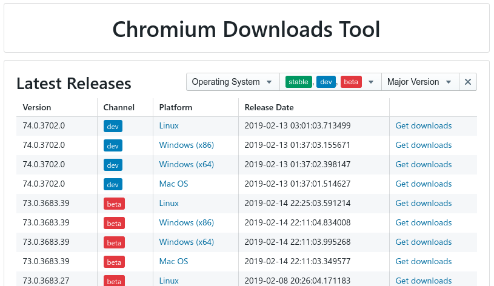

# chromium-downloads

[](https://github.com/sekedus/chromium-downloads/actions/workflows/node.js.yml)

Live at: https://chromium.cypress.io

[](https://github.com/sekedus/chromium-downloads)

## Installing dependencies

```
yarn install
```

## Starting the dev server

```
yarn start
```
